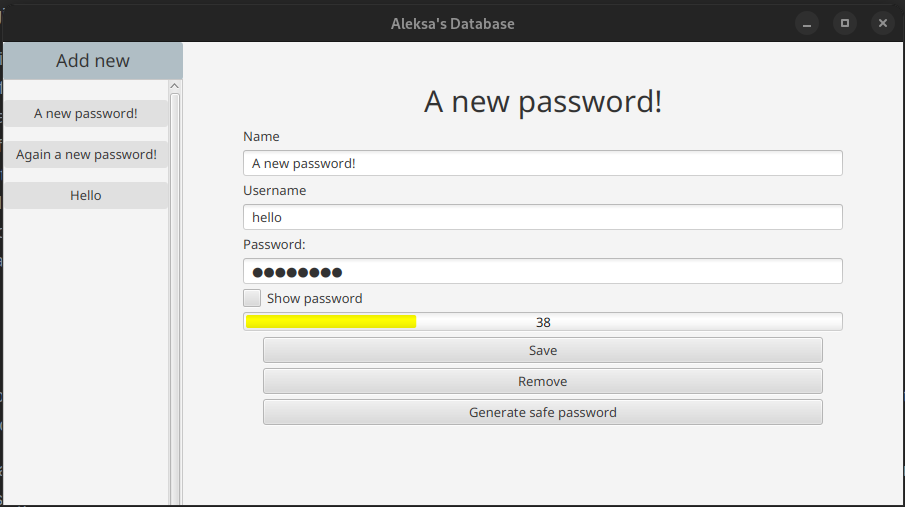

# JPassLocker

JPassLocker is a simple password management tool written in Java. It allows users to securely store and manage their passwords in an encrypted format. This project aims to provide a user-friendly interface for managing passwords while ensuring their confidentiality.
Features
<ul>
    <li>Securely stores passwords in an encrypted format</li>
    <li>User-friendly graphical interface</li>
    <li>Password generator for creating strong and unique passwords</li>
    <li>Easy search and retrieval of stored passwords</li>
    <li>Ability to add, edit, and delete passwords</li>
    <li>Import and export password data in CSV format</li>
    <li>Automatic lock after a period of inactivity for enhanced security</li>
    <li>Master password authentication for accessing the application</li>
</ul>

## Usage

Upon launching JPassLocker, you will be prompted to create a master password. This password will be used to access the application and encrypt your stored passwords. Choose a strong and memorable password and confirm it.

Once you have set the master password, you will be presented with the main application window. Here, you can add, edit, and delete passwords using the provided options. You can also search for specific passwords using the search bar.

To generate a strong password, click on the "Generate Password" button and specify the desired length and complexity. The generated password will be automatically copied to your clipboard for easy use.

You can import and export your password data in CSV format for backup or transfer purposes. The import and export options can be accessed through the "File" menu.

JPassLocker automatically locks itself after a period of inactivity to prevent unauthorized access. To unlock the application, simply enter your master password.
Contributing

Contributions to JPassLocker are welcome! If you would like to contribute, please follow these steps:

<ol>
    <li>Fork the repository on GitHub.</li>
    <li>Create a new branch for your feature or bug fix.</li>
    <li>Make your changes and commit them with descriptive messages.</li>
    <li>Push your changes to your fork.</li>
    <li>Submit a pull request to the main repository.</li>
</ol>

## License

JPassLocker is released under the <b>MIT License</b>. Feel free to use, modify, and distribute this software according to the terms of the license.
Credits

JPassLocker was created by Aleksa.

If you encounter any issues or have any questions, please open an issue on the GitHub repository.